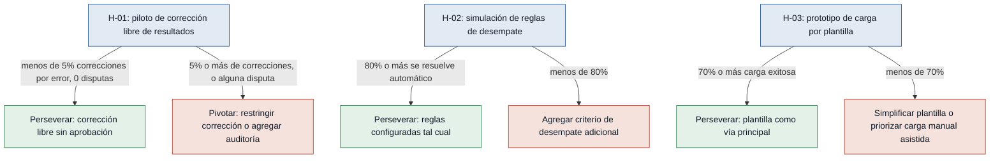

# Hipótesis y experimentos — sportcontrol

Ordenadas de mayor a menor riesgo: primero se prueba lo que más puede tumbar el
MVP (que la corrección libre de resultados degrade la confianza en la Tabla
General), antes de invertir en construir todo el sistema.

### [H-01] Corrección libre de resultados sin aprobación — riesgo: alto
- **Supuesto a probar:** que permitir a cualquier Staff corregir cualquier resultado de la edición activa sin aprobación no genera errores no detectados ni disputas de reglamento.
- **Hipótesis:** Creemos que el Staff logrará mantener la Tabla General confiable sin proceso de aprobación si mantenemos la corrección libre entre Staff, porque conocen las reglas y actúan en tiempo real durante el partido (staff.md).
- **Señal medible:** número de correcciones de resultados que generan una disputa formal de un Capitán o Administrador, y proporción de resultados que requieren una segunda corrección por error, durante una jornada piloto.
- **Criterio de éxito:** menos del 5% de los resultados registrados requieren una segunda corrección por error, y cero disputas formales de Capitanes sobre resultados finales en la jornada piloto.
- **Experimento:** Mago de Oz / piloto controlado — operar una jornada real del torneo con 2-3 Staff registrando y corrigiendo resultados libremente sin aprobación, mientras el Administrador lleva un registro paralelo de discrepancias sin intervenir salvo error grave.
- **Caja de tiempo/costo:** 1 jornada de torneo (medio día), sin construir nada adicional; se usa el flujo ya diseñado.
- **Regla de decisión:** Si pasa (menos del 5% de correcciones por error y cero disputas) → perseverar con corrección libre en el MVP tal como está diseñada. Si falla (5% o más, o alguna disputa formal) → pivotar a restringir la corrección al Staff asignado a esa disciplina/partido, o agregar un registro de auditoría visible al Administrador antes de escalar a un flujo de aprobación.

### [H-02] Cobertura de las reglas de desempate — riesgo: medio
- **Supuesto a probar:** que las reglas de desempate configurables de la Tabla General cubren los casos reales de empate que ocurrirán en un torneo, sin requerir demasiadas intervenciones manuales del Administrador.
- **Hipótesis:** Creemos que el Administrador podrá resolver los empates de la Tabla General usando solo las reglas configurables si definimos 2-3 criterios de desempate estándar, porque cubren los patrones más comunes de torneos por puntos (administrador.md).
- **Señal medible:** proporción de empates de la Tabla General resueltos automáticamente por las reglas configuradas frente a los que requieren el valor de desempate manual del Administrador, en una edición piloto o simulada.
- **Criterio de éxito:** al menos el 80% de los empates de la Tabla General se resuelven automáticamente con las reglas configuradas, sin intervención manual, al cierre de la edición piloto.
- **Experimento:** simulación con datos de una edición pasada o piloto — correr resultados reales o simulados de un torneo contra la lógica de reglas de desempate configurada y contar cuántos empates quedan sin resolver automáticamente.
- **Caja de tiempo/costo:** 1-2 días, usando datos históricos si existen o un torneo simulado de prueba; no requiere construir el sistema completo, solo la lógica de desempate.
- **Regla de decisión:** Si pasa (80% o más resuelto automáticamente) → perseverar con las reglas configuradas tal como están. Si falla (menos del 80%) → agregar un criterio de desempate adicional antes de construir el resto del MVP, o documentar explícitamente que el valor de desempate manual será frecuente y ajustar la expectativa del Administrador.

### [H-03] Simplicidad de la carga por plantilla — riesgo: medio
- **Supuesto a probar:** que cargar equipos y participantes desde una plantilla/archivo es suficientemente simple para que el Administrador no vuelva a registrar cada participante manualmente uno por uno.
- **Hipótesis:** Creemos que el Administrador preferirá y usará la carga por plantilla en vez de la carga manual si le entregamos una plantilla simple (nombre, equipo, disciplinas), porque hoy declara que la validación manual es su mayor carga operativa (administrador.md).
- **Señal medible:** proporción de participantes de una edición piloto cargados exitosamente vía plantilla en el primer intento, frente a los cargados manualmente por error de formato o dato faltante.
- **Criterio de éxito:** al menos el 70% de los participantes de la edición piloto se cargan exitosamente vía plantilla en el primer intento, sin corrección manual masiva.
- **Experimento:** prototipo desechable — entregar al Administrador una plantilla (hoja de cálculo) para cargar los participantes de una edición real o de prueba, y medir cuántos carga así frente a cuántos termina ingresando manualmente.
- **Caja de tiempo/costo:** medio día, solo con la plantilla y una carga de prueba, sin construir el importador completo del sistema.
- **Regla de decisión:** Si pasa (70% o más de carga exitosa por plantilla) → perseverar con la carga por plantilla como vía principal del MVP. Si falla (menos del 70%) → pivotar a simplificar la plantilla o priorizar el flujo de carga manual asistida en vez de invertir en el importador de archivos.
