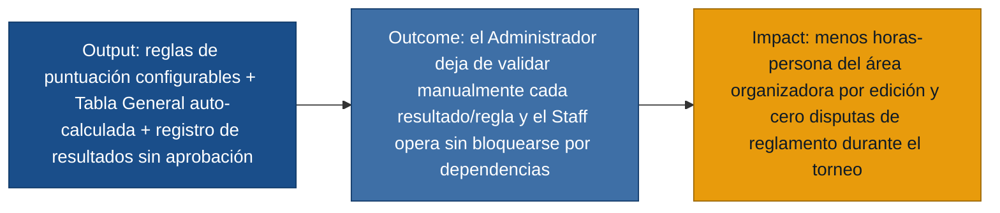

# MVP Canvas — sportcontrol

| Bloque | Contenido |
|---|---|
| Propuesta de valor | Automatizar la aplicación del reglamento del torneo (puntuación, desempates, Tabla General) para que el Administrador y el Staff dejen de validar y calcular manualmente, y para que el Capitán tenga visibilidad transparente de nóminas y resultados. |
| Segmento de usuarios | Administrador y Staff operativo primero (dolor más repetido y más costoso: carga operativa e interpretación subjetiva del reglamento); Capitán de equipo como segundo segmento (transparencia de nóminas). |
| Funcionalidades mínimas | Creación de una edición activa con equipos, participantes y disciplinas (US-01, US-03, US-04); configuración de sistemas de puntuación por posiciones y semifinal+final (US-02); registro y corrección libre de resultados por cualquier Staff, sin aprobación (US-06, US-07); resolución de desempates (US-08); puntos adicionales (US-05); Tabla General calculada automáticamente y de solo lectura (US-11) con reglas de desempate configurables (US-12); marcado de asistencia por equipo (US-09); vista de inicio del Staff con accesos rápidos (US-10); consulta de nómina propia y rival, y de fixture/resultados en modo lectura para el Capitán (US-13, US-14, US-15). |
| Resultado esperado (outcome) | El Administrador y el Staff dejan de resolver a mano quién ganó, cuántos puntos suma cada equipo o si hay empate: el sistema lo calcula y lo publica sin fricción ni cuello de botella por dependencia de una sola persona. El Capitán puede confirmar por sí mismo que las nóminas son correctas sin pedirlo al Administrador. |
| Métrica de éxito | Horas-persona del área organizadora dedicadas a validar manualmente resultados, puntuación y desempates por edición (objetivo: reducción medible edición sobre edición). Pasa la prueba ácida: si baja, el área organizadora decide si puede sostener el torneo con el mismo personal o reasignarlo a otra tarea. |
| Riesgos / supuestos | (1) Que permitir a cualquier Staff corregir cualquier resultado sin aprobación no genere errores no detectados en la operación real (solo respaldado por staff.md, sin datos de campo aún). (2) Que el cálculo automático de la Tabla General cubra todos los casos de desempate que en la práctica ocurran. (3) Que la carga de equipos/participantes por plantilla sea suficientemente simple para que el Administrador no vuelva a hacerlo manualmente. |
| Fuera de alcance (por ahora) | Exportación de reporte final en PDF/Excel (R-20); recuperación de contraseña por correo electrónico, solo reseteo manual del Administrador (R-21); penalizaciones (R-14); notificaciones push al Capitán (R-36); acceso del Capitán a la Tabla General (R-35); multi-edición histórica con reglas de bloqueo estrictas (R-02) — se registra la edición cerrada pero no se construye el flujo completo de histórico en esta versión. |
