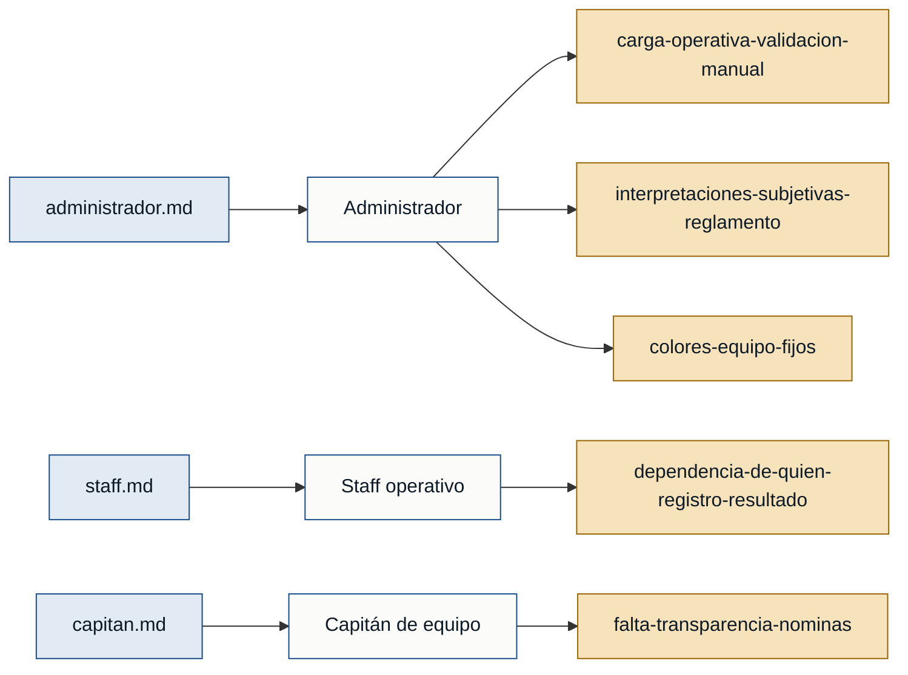

# Personas y stakeholders — sportcontrol

## Mapa de trazabilidad

## Personas

### Administrador — administrador del evento
- **Contexto:** encargado de crear y configurar cada edición del torneo: ediciones, equipos, disciplinas, reglas de puntuación, puntos adicionales, desempates y cierre (administrador.md).
- **Objetivo principal:** automatizar la aplicación del reglamento del torneo, reduciendo decisiones manuales, interpretaciones subjetivas y carga operativa del área organizadora (administrador.md).
- **Dolores:**
  - `carga-operativa-validacion-manual`: el personal debe validar manualmente cada regla, nómina o resultado del torneo (administrador.md).
  - `interpretaciones-subjetivas-reglamento`: sin automatización, las decisiones sobre el reglamento quedan sujetas a interpretación subjetiva (administrador.md).
  - `colores-equipo-fijos`: rigidez de versiones anteriores que amarraban el sistema a colores de equipo fijos en vez de configurables por edición (administrador.md).
- **Respaldo:** primera mano (administrador.md).

### Staff operativo — staff del evento
- **Contexto:** personal operativo que trabaja exclusivamente sobre la edición activa, registrando resultados, asistencia, ajustes de fixture y puntos adicionales (staff.md).
- **Objetivo principal:** operar rápido y sin fricciones: registrar y corregir resultados sin depender de aprobaciones ni de quién los cargó primero (staff.md).
- **Dolores:**
  - `dependencia-de-quien-registro-resultado`: se busca que cualquier Staff pueda corregir cualquier resultado, para que la operación no dependa de quién registró primero el marcador (staff.md).
- **Respaldo:** primera mano (staff.md).

### Capitán de equipo — capitán
- **Contexto:** representante de un equipo que consulta información propia y de rivales para organizar a su equipo y verificar transparencia del torneo (capitan.md).
- **Objetivo principal:** estar al tanto de la nómina, disciplinas asignadas, fixture y resultados de su equipo, y confirmar que las nóminas oficiales (propias y rivales) sean correctas (capitan.md).
- **Dolores:**
  - `falta-transparencia-nominas`: necesidad de revisar nóminas oficiales de otros equipos para confirmar que los participantes estén registrados correctamente y dar transparencia al torneo (capitan.md).
- **Respaldo:** primera mano (capitan.md).

## Descartado como persona (constancia)

### Participante / Jugador — NO es persona del sistema
- **Por qué se descarta:** una persona representa un actor que **usa el sistema**. El Participante/Jugador no inicia sesión ni interactúa directamente con la app — administrador.md es explícito: "Los participantes o jugadores pueden estar registrados solo como integrantes de un equipo, sin necesidad de iniciar sesión." Es una **entidad de datos** gestionada por el Administrador (quien lo registra) y consultada por el Capitán (quien revisa la nómina), no un rol con objetivo propio frente al sistema.
- **Dónde vive esa evidencia:** administrador.md (registro, atributos, sin cuenta), capitan.md (consulta de nómina de su equipo y de equipos rivales).
- **Decisión:** no se modela como persona (ni primaria ni secundaria) en `evidence-map.json`. Los requisitos derivados de su registro y consulta (R-05, R-06, R-07 en `requisitos.md`) se mantienen, atribuidos a las personas que sí actúan sobre esos datos (Administrador, Capitán).
- **Si esto cambia:** si en una futura versión el Jugador obtiene cuenta propia y pasa a interactuar con el sistema, habrá que conseguir su entrevista de primera mano antes de modelarlo como persona.

## Stakeholders

### Área organizadora del evento
- **Interés en el sistema:** reducir la carga operativa del personal organizador y evitar interpretaciones subjetivas del reglamento, delegando en el sistema la aplicación automática de reglas de puntuación, desempates y cierre de edición.
- **Fuente:** administrador.md.
