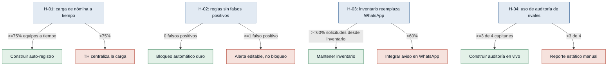

# Hipótesis y experimentos — sportscontrol

Supuestos riesgosos extraídos del bloque "Riesgos / supuestos" de `mvp-canvas.md`,
ordenados de mayor a menor riesgo. Cada uno es el puente entre el output (las
funcionalidades de US-01 a US-07) y el impact (0 incidentes de nómina inválida
escalados durante el torneo).

### [H-01] Carga disciplinada de nómina a tiempo — riesgo: alto
- **Supuesto a probar:** los capitanes cargarán la nómina completa de su equipo
  (máximo 28, colores, roles) en el sistema antes del inicio del torneo, sin
  necesitar persecución manual de Talento Humano.
- **Hipótesis:** Creemos que los capitanes lograrán cargar el 100% de su nómina
  al menos 48 horas antes del inicio del torneo si se les da un formulario
  simple de auto-registro con validación en línea, porque hoy ya son
  responsables de armar y validar su propia plantilla (captain.md).
- **Señal medible:** porcentaje de equipos (de los 4) con nómina completa
  cargada 48 horas antes del inicio del torneo, sin recordatorio manual.
- **Criterio de éxito:** al menos 75% de los equipos (3 de 4) completan su
  nómina 48 horas antes, sin seguimiento manual de Talento Humano.
- **Experimento:** Mago de Oz — antes de construir el formulario, Talento
  Humano envía a los 4 capitanes una hoja de carga simple (Google Form/Excel)
  y mide cuántos la completan a tiempo sin recordatorio.
- **Caja de tiempo/costo:** 1 semana; costo de desarrollo nulo.
- **Regla de decisión:** Si pasa (≥75%) → construir el formulario de
  auto-registro de US-01/US-02 tal como está planteado. Si falla (<75%) →
  pivotar: Talento Humano centraliza la carga/validación de la nómina con
  apoyo de un asistente, en lugar de delegarla por completo a los capitanes.

### [H-02] Confianza en el motor de reglas sin falsos positivos — riesgo: alto
- **Supuesto a probar:** las reglas codificadas (tope de 28, color fijo, cruce
  de horarios, deporte de balón en el Campeonato de 40) están bien definidas y
  no generan bloqueos incorrectos que Talento Humano deba revertir a mano.
- **Hipótesis:** Creemos que Talento Humano podrá confiar en el motor de
  reglas de nómina si, al simular las inscripciones de un torneo real o de
  prueba contra las reglas codificadas, el sistema no produce bloqueos
  incorrectos, porque las reglas provienen directamente del estatuto
  normativo que hoy aplican a mano (human-talent-manager.md).
- **Señal medible:** número de bloqueos incorrectos (falsos positivos)
  detectados al simular las reglas sobre al menos 40 inscripciones
  representativas.
- **Criterio de éxito:** 0 falsos positivos en la simulación de al menos 40
  inscripciones representativas, revisadas una por una por Talento Humano.
- **Experimento:** prototipo desechable — una hoja de cálculo o script simple
  que aplique las reglas codificadas sobre datos de inscripción reales o
  sintéticos de un torneo anterior, que Talento Humano revisa caso por caso.
- **Caja de tiempo/costo:** 3 días; costo bajo.
- **Regla de decisión:** Si pasa (0 falsos positivos) → construir el motor de
  reglas como bloqueo automático duro en el MVP (US-01 a US-04). Si falla
  (≥1 falso positivo) → aclarar y ajustar las reglas con Talento Humano antes
  de automatizar el bloqueo, dejando una alerta editable en vez de un
  bloqueo duro hasta resolverlo.

### [H-03] El inventario de plantilla reemplaza a WhatsApp — riesgo: medio
- **Supuesto a probar:** los capitanes usarán el inventario de plantilla en
  vivo (Libre / Jugando / Lesionado) en lugar de coordinar por WhatsApp
  durante el torneo.
- **Hipótesis:** Creemos que los capitanes consultarán el inventario de
  plantilla en vivo en lugar de preguntar por WhatsApp si el inventario está
  disponible y se actualiza en tiempo real durante los partidos, porque hoy
  reportan perder tiempo coordinando por esa vía (captain.md,
  `logistica-ciegas`).
- **Señal medible:** porcentaje de solicitudes de apoyo interno que se
  originan consultando el inventario de plantilla, frente a las que se
  originan por WhatsApp, durante una jornada piloto del torneo.
- **Criterio de éxito:** al menos 60% de las solicitudes de apoyo se originan
  desde el inventario durante la primera jornada piloto.
- **Experimento:** smoke test con prototipo mínimo — lanzar una versión de
  solo lectura del inventario a los 4 capitanes durante una jornada del
  torneo y comparar su uso reportado contra los grupos de WhatsApp
  existentes.
- **Caja de tiempo/costo:** 1 jornada del torneo; desarrollo mínimo (ya
  necesario para US-05).
- **Regla de decisión:** Si pasa (≥60%) → mantener el inventario como
  reemplazo de WhatsApp en las siguientes jornadas y avanzar con US-05/US-06
  completas. Si falla (<60%) → investigar la causa (confiabilidad de los
  datos o hábito) y considerar integrar el aviso del inventario dentro del
  propio WhatsApp en lugar de competir con él.

### [H-04] Uso real de la auditoría de nómina de rivales — riesgo: bajo
- **Supuesto a probar:** los capitanes realmente usarán la función de
  auditar la nómina de equipos rivales para resolver su desconfianza, en
  lugar de solo quejarse informalmente.
- **Hipótesis:** Creemos que los capitanes usarán la auditoría de nómina de
  rivales al menos una vez antes de cada fase eliminatoria si la función es
  fácil de encontrar y de leer, porque hoy expresan desconfianza activa
  sobre el cumplimiento de las reglas por parte de otros equipos
  (captain.md, `falta-transparencia-rivales`).
- **Señal medible:** número de capitanes (de 4) que consultan la nómina de
  al menos un equipo rival antes de la primera fase eliminatoria.
- **Criterio de éxito:** al menos 3 de los 4 capitanes consultan la nómina de
  un rival antes de la primera fase eliminatoria.
- **Experimento:** fake door — agregar un botón "Auditar nómina rival"
  visible en el prototipo del inventario de plantilla, aunque al inicio
  muestre datos estáticos cargados a mano, y medir clics durante una semana.
- **Caja de tiempo/costo:** 1 semana; costo muy bajo.
- **Regla de decisión:** Si pasa (≥3 de 4) → priorizar la construcción
  completa de la auditoría en vivo (US-07). Si falla (<3 de 4) → degradar la
  función a un reporte estático que Talento Humano publica manualmente cada
  cierto tiempo, en lugar de construir una consulta en vivo.
