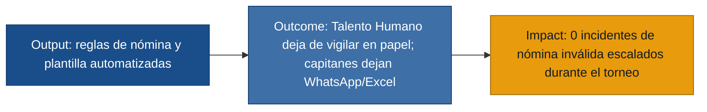

## MVP Canvas — SportsControl: nómina y plantilla bajo control

| Bloque | Contenido |
|---|---|
| Propuesta de valor | Reemplazar el control manual en papel de nóminas por un sistema que hace cumplir automáticamente las reglas de inscripción (tope de 28, un solo color por jugador, sin cruces de horario, sin doble participación en deportes de balón en el Campeonato de 40) y que da a cada capitán visibilidad en tiempo real de su plantilla y la de sus rivales. |
| Segmento de usuarios | Representante de Talento Humano (organizador principal) y Capitán de equipo — las dos personas con respaldo de primera mano. |
| Funcionalidades mínimas | (1) Bloqueo automático de registro al llegar a 28 integrantes (US-01). (2) Color de equipo fijo por jugador, sin "baile" entre equipos (US-02). (3) Alerta de cruce de horario entre disciplinas (US-03). (4) Sombreado de jugadores que ya jugaron deporte de balón al armar la dupla del Campeonato de 40 (US-04). (5) Inventario de plantilla con estado dinámico por jugador (US-05). (6) Solicitud de apoyo interno sugiriendo solo jugadores libres (US-06). (7) Auditoría de solo lectura de la nómina de un equipo rival por color (US-07). |
| Resultado esperado (outcome) | Talento Humano deja de ser el filtro policial manual de nóminas: las reglas se cumplen porque el sistema las hace cumplir, no porque alguien las vigile en papel. Los capitanes dejan de depender de WhatsApp y Excel para saber quién está libre o si un rival cumple las reglas. |
| Métrica de éxito | Número de incidentes de nómina inválida (exceso de 28 integrantes, jugador en dos equipos, refuerzo no autorizado entre equipos) que llegan a escalarse a Talento Humano durante el torneo. Meta: 0 incidentes en el primer Sport Day donde se use el sistema. Si el número no es 0, Talento Humano sabe que debe seguir reservando tiempo para el control manual de respaldo; si es 0, puede retirar ese control manual para el siguiente torneo. |
| Riesgos / supuestos | (1) Los capitanes cargan la nómina inicial de forma disciplinada y a tiempo — no validado, requiere observación en el primer uso. (2) Talento Humano confía en que el bloqueo automático no tiene falsos positivos que generen nuevas disputas — riesgo si la regla de "deporte de balón" no captura bien todas las disciplinas. (3) Los capitanes realmente abandonan WhatsApp/Excel a favor del inventario de plantilla — no garantizado, es un cambio de hábito. |
| Fuera de alcance (por ahora) | Reglas de marcador en vivo y cierre automático de partidos (R-07, R-08): requieren un motor de reglas por disciplina, mucho más costoso que el control de nóminas y es un dolor exclusivo de Talento Humano, sin presión de los capitanes. Consolidación automática de la Tabla General y desempates (R-09, R-10): depende de que el marcador en vivo ya exista. Bandera de "Incumplimiento del Espíritu de Integración" por sustituciones no registradas (R-06): regla secundaria, no bloquea el torneo si falta. Fixtures interactivos con notificaciones push (R-12): mejora de experiencia, no resuelve el dolor central de nómina/transparencia. Resolución del problema de notificación tardía de árbitros (R-14, `telefono-roto-arbitraje`): depende del motor de marcador en vivo, que queda fuera de este MVP. |

