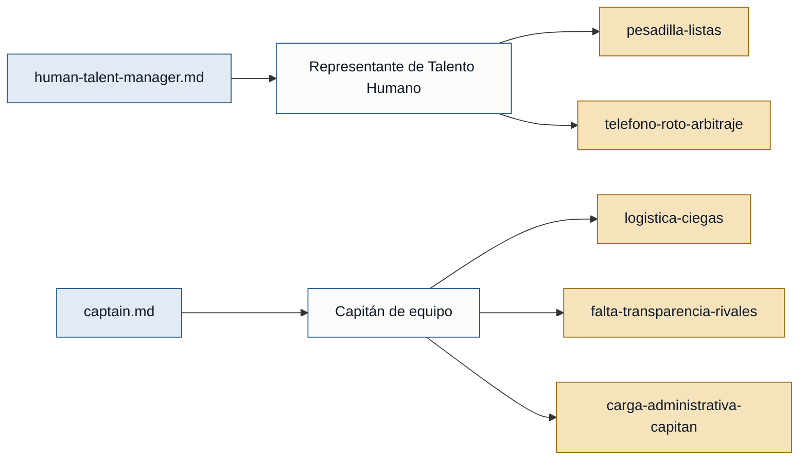

# Personas y stakeholders — sportscontrol

## Personas

### Representante de Talento Humano — organizador principal del evento
- **Contexto:** integrante del área de Talento Humano que organiza el torneo
  corporativo "Sport Day" y hace cumplir el estatuto normativo institucional
  (human-talent-manager.md).
- **Objetivo principal:** que la app actúe como "juez supremo" inmutable que
  haga cumplir las reglas sin excepciones, liberando a Talento Humano de ser
  el filtro policial del torneo (human-talent-manager.md).
- **Dolores:**
  - Control manual de nóminas (tope de 28, habilitación de pasantes y
    prestadores de servicios, evitar "baile" de jugadores entre equipos) es un
    caos en papel (`pesadilla-listas`, human-talent-manager.md).
  - Los árbitros notifican resultados tarde o en formatos inconsistentes, lo
    que genera acusaciones de favoritismo institucional cuando la Tabla
    General se actualiza mal o con retraso (`telefono-roto-arbitraje`,
    human-talent-manager.md).
- **Respaldo:** `primera mano` (human-talent-manager.md).

### Capitán de equipo
- **Contexto:** colaborador designado para armar la estrategia de su escuadra,
  validar nóminas y coordinar a sus 28 jugadores durante el torneo
  (captain.md).
- **Objetivo principal:** gestionar su plantilla y competir bajo reglas
  parejas y verificables, sin perder tiempo en logística manual (captain.md).
- **Dolores:**
  - No puede ver en tiempo real qué jugadores de su plantilla ya jugaron o
    están libres; depende de WhatsApp para coordinar apoyos internos
    (`logistica-ciegas`, captain.md).
  - No puede auditar las plantillas de los equipos rivales, lo que le genera
    duda sobre si cumplen las restricciones del Campeonato de 40
    (`falta-transparencia-rivales`, captain.md).
  - Pasa más tiempo resolviendo reclamos de sus compañeros y cuadrando
    horarios en Excel que disfrutando del evento (`carga-administrativa-capitan`,
    captain.md).
- **Respaldo:** `primera mano` (captain.md).

### Árbitro / responsable de mesa de control
- **Contexto:** persona encargada de dirigir los encuentros y reportar
  resultados y sanciones a la organización (mencionado en
  human-talent-manager.md y captain.md).
- **Objetivo principal:** registrar resultados de forma confiable y a tiempo
  (inferido del contexto; no declarado en primera persona).
- **Dolores:** no hay declaraciones propias; el dolor de "notificación tardía
  o inconsistente" se describe desde la óptica de Talento Humano, no del
  árbitro (human-talent-manager.md).
- **Respaldo:** `referenciada` — mencionado por Talento Humano y por el
  capitán, sin entrevista propia.

### Jugador / colaborador de plantilla (no capitán)
- **Contexto:** colaborador, pasante preprofesional/dual o prestador de
  servicios que integra una escuadra bajo la coordinación de su capitán
  (mencionado en human-talent-manager.md y captain.md).
- **Objetivo principal:** participar en su disciplina sin disputas por errores
  de registro ni suplantaciones (inferido del contexto).
- **Dolores:** no hay entrevista propia de este rol; sus dolores potenciales
  se infieren de lo que reporta el capitán sobre su plantilla, no de su propia
  voz.
- **Respaldo:** `referenciada` — mencionado por Talento Humano y por el
  capitán, sin entrevista propia.

## Stakeholders

### Institución organizadora
- **Interés en el sistema:** fomentar el compañerismo, el trabajo en equipo y
  el juego limpio; proteger su reputación frente a acusaciones de favoritismo
  institucional cuando hay errores o demoras en el registro (human-talent-manager.md).
- **Fuente:** human-talent-manager.md.

### Delegaciones / escuadras rivales (Cian, Verde, Púrpura, Azul)
- **Interés en el sistema:** que las reglas de inscripción, elegibilidad y
  topes de nómina se cumplan de forma pareja y auditable entre todos los
  equipos, sin refuerzos no autorizados (captain.md, human-talent-manager.md).
- **Fuente:** captain.md, human-talent-manager.md.

## Mapa de trazabilidad

